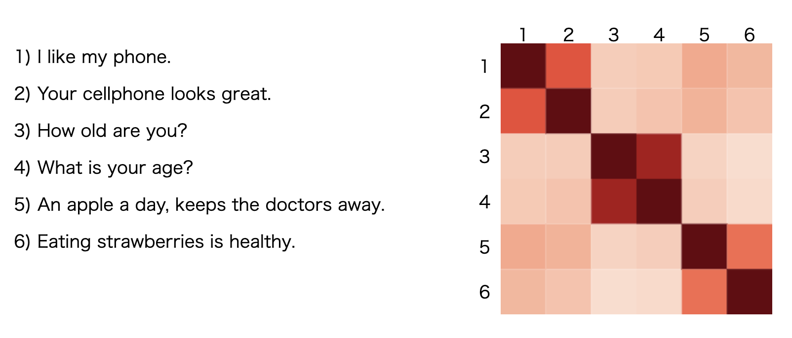

# Universal Sentence Encoder (USE) を学ぶ

## Universal Sentence Encoder (USE)とは

Universal Sentence Encoder (USE) は、文をベクトル化する手法です。Google の研究者達が開発したもので、2018年に Tensorflow Hub で公開されました。

USEにより生成されたデータは、[感情分類](https://en.wikipedia.org/wiki/Sentiment_analysis)や[テキスト類似度](https://en.wikipedia.org/wiki/Semantic_similarity)分析等、自然言語処理の入力データとして使用できます。

この例では、Transformer アーキテクチャをベースにし、[8kの語彙](https://storage.googleapis.com/tfjs-models/savedmodel/universal_sentence_encoder/vocab.json)で学習した USE の軽量モデルを利用しています。

参照：

- [https://github.com/tensorflow/tfjs-models/tree/master/universal-sentence-encoder](https://github.com/tensorflow/tfjs-models/tree/master/universal-sentence-encoder)
- [https://www.tensorflow.org/hub/tutorials/semantic_similarity_with_tf_hub_universal_encoder?hl=ja](https://www.tensorflow.org/hub/tutorials/semantic_similarity_with_tf_hub_universal_encoder?hl=ja)

##  デモ

[https://t-cool.github.io/universal-sentence-encoder-demo/](https://t-cool.github.io/universal-sentence-encoder-demo/)

## ライセンス

Apache License 2.0
